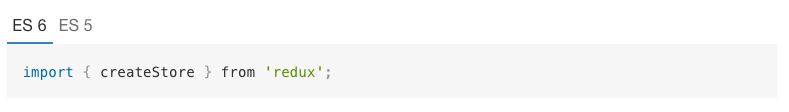

# es6tabs

Include ES 6 code blocks, with automatically generated ES 5 preview using [Babel](https://babeljs.io/).



### Installation

Adds the plugin to your `book.json`, then run `gitbook install` if you are building your book locally.

```js
{
    "plugins": ["es6tabs"]
}
```

### Usage

```md

This is some ES 6 code, you can also see the ES 5 output:


import {test} from './test';

let myVar = 'test';

```


